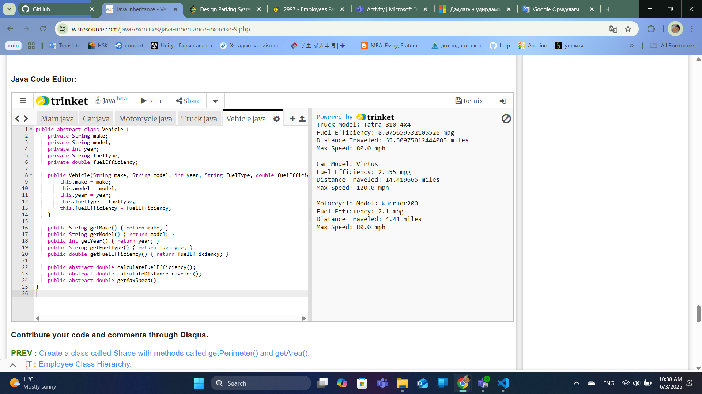
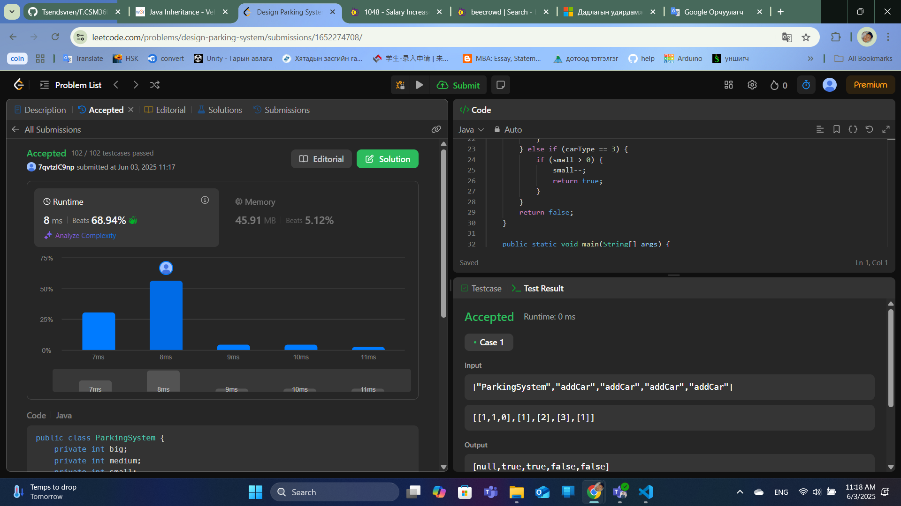
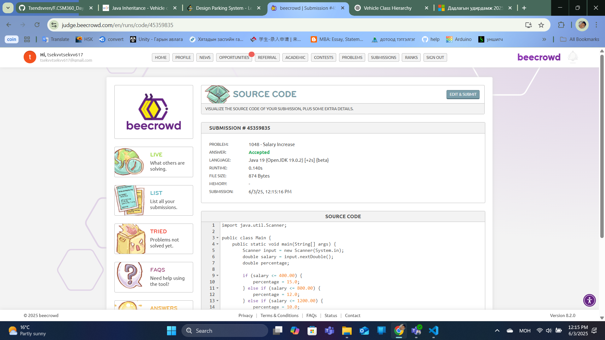
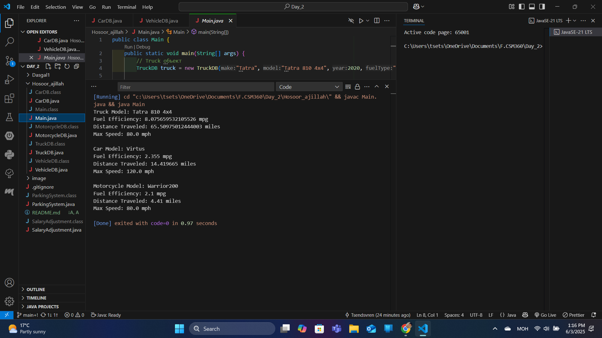

  

<h1 align="center">ШИНЖЛЭХ УХААН, ТЕХНОЛОГИЙН ИХ СУРГУУЛЬ</h1>
<h2 align="center">МЭДЭЭЛЭЛ, ХОЛБООНЫ ТЕХНОЛОГИЙН СУРГУУЛЬ</h2>

---

## АЖЛЫН ТАЙЛАН №2

---

**Хичээл:** F.CSM360 Программчлалын дадлага
**Хичээлийн жил:** 2024-2025 оны зун  

**Хичээл заасан багш:** А.Отгонбаяр /F.SW02/  
**Ажил гүйцэтгэсэн:** Оюутан - Ц.Цэндсүрэн /B242270128/  

 Улаанбаатар хот  

---

### Ажил 1-ийн үр дүн:

  

---

VSCode-ийн гаралт:

Truck Model: Tatra 810 4x4

Fuel Efficiency: 8.075659532105526 mpg

Distance Traveled: 65.50975012444003 miles

Max Speed: 80.0 mph

Car Model: Virtus

Fuel Efficiency: 2.355 mpg

Distance Traveled: 14.419665 miles

Max Speed: 120.0 mph

Motorcycle Model: Warrior200

Fuel Efficiency: 2.1 mpg

Distance Traveled: 4.41 miles

Max Speed: 80.0 mph

---

### Ажил 2-ийн үр дүн:

  

---

true

true

false

false

---

### Ажил 3-ийн үр дүн:

  

---

VSCode-ийн гаралт:

Novo salario: 460.00

Reajuste ganho: 60.00

Em percentual: 15 %

Novo salario: 880.01

Reajuste ganho: 80.00

Em percentual: 10 %

Novo salario: 2140.00

Reajuste ganho: 140.00

Em percentual: 7 %

### Ажил 4-ийн үр дүн:

  

---

VSCode-ийн гаралт:

Truck Model: Tatra 810 4x4

Fuel Efficiency: 8.075659532105526 mpg

Distance Traveled: 65.50975012444003 miles

Max Speed: 80.0 mph

Car Model: Virtus

Fuel Efficiency: 2.355 mpg

Distance Traveled: 14.419665 miles

Max Speed: 120.0 mph

Motorcycle Model: Warrior200

Fuel Efficiency: 2.1 mpg

Distance Traveled: 4.41 miles

Max Speed: 80.0 mph

✅ **ТАЙЛАН ДУУСАВ!**
